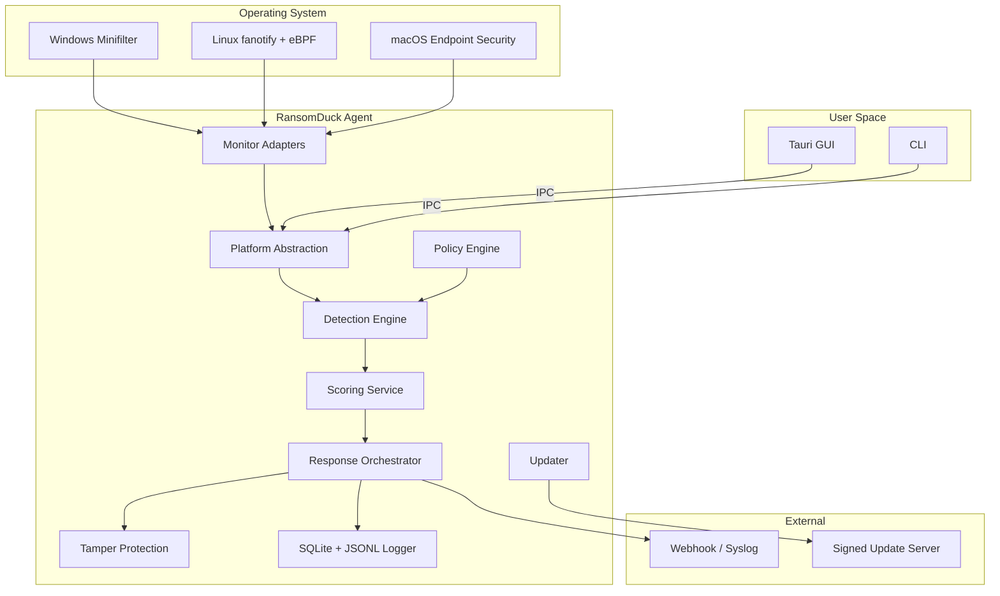
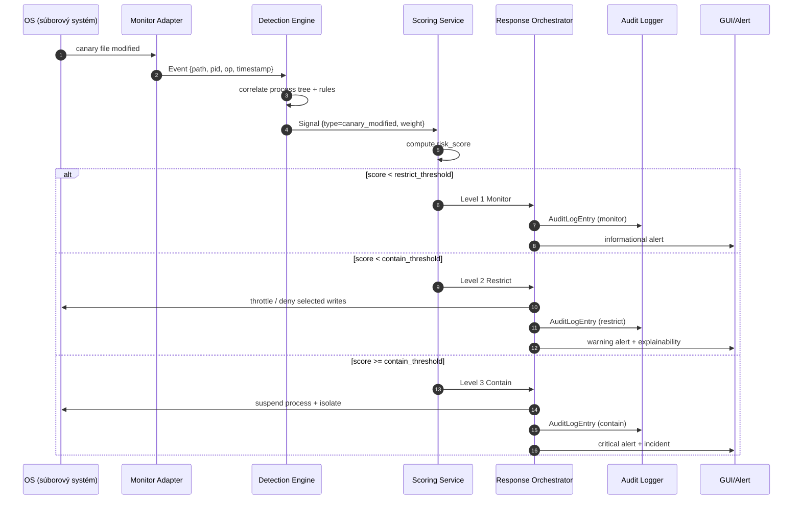

# RansomDuck — Design Document

## 1. Executive Summary

**RansomDuck** is a **ransomware containment layer** designed for small and medium-sized businesses, schools, freelancers, and non-profits that lack the budget or expert staff for a full enterprise EDR, but need reliable local protection of data against mass encryption. The product does not act as an antivirus or a replacement for backups — it complements existing security with rapid attack detection and controlled isolation of the affected process.

### Target groups

* Small businesses with 10–250 endpoints,
* Schools and educational institutions with shared devices,
* Freelancers and small creative teams,
* Non-profit organizations with sensitive data and limited IT resources.

### Value proposition

* **Local decision-making** — the main controller runs locally; it is not tied to a permanent cloud connection.
* **Transparent scoring** — every decision is explainable through weighted signals and thresholds.
* **Containment instead of just detection** — at a high score it can suspend or restrict a suspicious process before it encrypts all data.
* **Cross-platform architecture** — one agent with separate platform adapters for Windows, Linux, and macOS.
* **Easy deployment** — MSI installer for Windows, deb package for Debian/Ubuntu, Slovak and English localization.

### 1.1 Product name and alternatives

The final product name is **RansomDuck**. The duck in the name refers to a playful yet vigilant guardian that places decoy ducks among files and “quacks” when someone starts encrypting data. Before the public launch we still recommend verifying domain and social-media account availability — although the GitHub repository under this name is currently available.

| Name | Why it works / why not | Availability / risk |
|---|---|---|
| **RansomDuck** | Playful name with a duck mascot; the *sitting duck* (easy victim) is turned against the attacker — our decoys are “ducks” that protect data. | GitHub repo available; domain/social media still need verification. |
| **FileCanary** | Clearly links files and the canary concept. | May collide with the Thinkst Canarytokens / OpenCanary idea. |
| **BastionFiles** | Evokes a fortress and data protection. | Less descriptive, greater marketing effort. |
| **RansomLock** | Short, suggestive. | The same name may be used by ransomware products themselves; bad for SEO. |
| **Cryptyx** / **Cryptyx Guard** | Modern sound, but abstract. | The user does not immediately see that it is anti-ransomware. |
| **RansomGuard** | A Polish heuristic project on GitHub already uses this name (development 2024, C++). | Conflict with an existing open-source project. |

**Recommendation:** Continue with the working name **RansomDuck**, but before the public launch do a trademark/domain/GitHub check. If `RansomDuck` is taken, the best alternatives are **FileCanary** or **BastionFiles**.

---

## 2. Current research on existing solutions

### 2.1 Open-source projects and tools

| Project | Principle | Verification notes |
|---|---|---|
| **Raccine** (Neo23x0) | Registers a debugger for `vssadmin.exe` and `wmic.exe`; upon detecting a shadow-copy deletion command it kills the entire parent process tree. | The GitHub README lists pros and cons: the method may kill legitimate backup tools, there are blind spots (e.g., scheduled tasks). Active maintenance is marked as *inactively maintained*. [Raccine GitHub](https://github.com/Neo23x0/Raccine), accessed 14. 6. 2026. |
| **OpenCanary** (Thinkst) | Network honeypot with many protocols; runs as a daemon and alerts on intrusion into the internal network. | According to the documentation it is a multi-protocol honeypot written in Python; it offers the most options on Linux. It does not provide endpoint file protection. [OpenCanary GitHub](https://github.com/thinkst/opencanary), accessed 14. 6. 2026. |
| **Canarytokens** (Thinkst) | Free services (files, URL, DNS, email) that generate an alert when opened/accessed. | The documentation states: “Drop and forget,” focused on detecting access to embedded tokens. [Canarytokens Docs](https://docs.canarytokens.org/), accessed 14. 6. 2026. |
| **RansomGuard** (0mWindyBug) | Anti-ransomware file-system filter written in C++ as a Windows minifilter. | A 2024 attempt; relatively small project (~71 ⭐), limited documentation, Windows only, requires a kernel driver. [RansomGuard GitHub](https://github.com/0mWindyBug/RansomGuard), accessed 14. 6. 2026. |
| **RansomwareLocker** (Aayushjn) | Honeyfile-based ransomware detection for Linux; simple shell script. | Old project (2019), Linux only, no automatic response or cross-platform support. [RansomwareLocker GitHub](https://github.com/Aayushjn/RansomwareLocker), accessed 14. 6. 2026. |
| **RansomLord** (malvuln) | Proof-of-concept tool that creates PE files to compromise ransomware before encryption. | Interesting red/blue approach, but not preventive protection for an average user; MIT license. [RansomLord GitHub](https://github.com/malvuln/RansomLord), accessed 14. 6. 2026. |

### 2.2 Built-in operating-system mechanisms

* **Microsoft Defender — Controlled Folder Access (CFA).** Allows write access to protected folders only to trusted applications; part of Microsoft Defender Antivirus. [Microsoft Learn — Controlled Folders](https://learn.microsoft.com/en-us/defender-endpoint/controlled-folders), updated 1. 6. 2026.
* **Microsoft Defender — Attack Surface Reduction (ASR).** A set of rules including “Use advanced protection against ransomware” that target common techniques abused by malware. [Microsoft Learn — ASR rules overview](https://learn.microsoft.com/en-us/defender-endpoint/attack-surface-reduction-rules-overview), updated 11. 6. 2026.
* **Windows — Volume Shadow Copy Service (VSS).** Coordinates creation of consistent recovery points; ransomware attacks precisely the deletion of shadow copies. [Microsoft Learn — VSS](https://learn.microsoft.com/en-us/windows-server/storage/file-server/volume-shadow-copy-service), updated 7. 7. 2025.
* **Windows — Filter Manager / minifilter.** Allows registering minifilter drivers in the kernel for monitoring and modifying I/O operations on the file system. [Microsoft Learn — Filter Manager Concepts](https://learn.microsoft.com/en-us/windows-hardware/drivers/ifs/filter-manager-concepts), updated 5. 11. 2025.
* **Windows — Device Security / HVCI.** Options such as Hypervisor-protected Code Integrity (HVCI) restrict loading of low-level drivers. [Microsoft Support — Device Security](https://support.microsoft.com/en-us/windows/device-security-in-the-windows-security-app-afa11526-de57-b1c5-599f-3a4c6a61c5e2), accessed 14. 6. 2026.
* **Linux — fanotify.** Kernel API for monitoring file events; from Linux 5.1 it supports creation, deletion, and moving. [Linux man7 fanotify(7)](https://man7.org/linux/man-pages/man7/fanotify.7.html), accessed 14. 6. 2026.
* **Linux — eBPF.** Allows safely running sandboxed programs in the kernel context without loading modules; suitable for monitoring syscalls and file operations. [eBPF.io — What is eBPF?](https://ebpf.io/what-is-ebpf/), accessed 14. 6. 2026.
* **macOS — Endpoint Security Framework.** Framework for monitoring and authorizing events including file, process, and boot events. [Apple Developer — Endpoint Security](https://developer.apple.com/documentation/endpointsecurity), accessed 14. 6. 2026.

### 2.3 EDR / anti-ransomware products

* **Huntress Managed EDR** — price $8.99/endpoint/month, managed 24/7 SOC, focused on persistence and ransomware. [Huntress Pricing](https://www.huntress.com/pricing), accessed 14. 6. 2026.
* **Malwarebytes Endpoint Protection** — cloud console model; strong in detection, but requires connectivity and per-endpoint billing.
* **CrowdStrike Falcon / SentinelOne / Sophos Intercept X** — enterprise EDR/XDR solutions with high performance, expensive licensing, and significant administrative overhead.

### 2.4 Canary-file products

* **Canarytokens** — the best-known free token generator (files, URL, DNS, emails) that alerts on access. Disadvantage: it does not include automatic local-machine reaction and relies on an external service.
* **Commercial canary solutions** (e.g., Thinkst Canary) — physical/virtual honeypots targeted at network detection, not local file protection.

---

## 3. Most common problems with existing anti-ransomware tools

We identified the following shortcomings based on public documentation, known incidents, and testing of existing tools:

1. **Cloud dependence.** Many EDRs (Huntress, CrowdStrike, Malwarebytes) require a cloud connection for analysis and response; a connectivity outage can delay or prevent protection.
2. **CFA disrupts legitimate applications.** Microsoft Controlled Folder Access often blocks backup tools and scripts; administrators spend a lot of time creating exceptions. Source: Microsoft Learn.
3. **CFA does not block ransomware that uses a trusted process.** If an application is on the trusted list, CFA does not consider it a threat even if it is abused.
4. **Raccine may kill the backup process.** Raccine kills the entire parent process tree upon detecting `vssadmin delete shadows`, which can interrupt scheduled backups. Source: Raccine README.
5. **Raccine is unmaintained and single-platform.** The repository is marked as *inactively maintained*, consists mostly of C++/C#, and does not support Linux or macOS.
6. **OpenCanary does not cover the local file system.** It is a network honeypot; an attack that runs locally on a single device may be missed.
7. **Canarytokens react only after being opened.** A forgotten file/token detects only when the attacker opens it; files that are encrypted without being opened do not trigger it.
8. **High price of enterprise EDR.** MSPs and small customers often do not have the budget for paid per-endpoint EDR (e.g., Huntress $8.99/endpoint/month; CrowdStrike/SentinelOne significantly more).
9. **Insufficient transparency.** Most EDRs use proprietary ML models; the user has no easy way to understand why a process was marked as a threat.
10. **Dependence on signatures and cloud reputation.** New ransomware samples often bypass cloud protection before the reputation is updated.
11. **Weak protection of remote / network shares.** Local tools monitor only the local disk; encryption of NAS or mapped drives can proceed without warning.
12. **Insufficient tamper resistance.** Open-source and cheap tools often run as an ordinary service without hardware or deep-kernel protection.
13. **Stability risk with kernel solutions.** Bad minifilter/eBPF drivers can cause BSOD/system crash and data loss.
14. **False positives with heuristics.** Aggressive rules that react to a large number of modified files can falsely flag conversion tools, compression, or indexing.
15. **Missing offline management and audit.** Cheap or cloud tools do not keep a complete history of events locally for a long time.

---

## 4. Competitor matrix

| Criterion | **RansomDuck** (proposed) | **Microsoft Defender CFA + ASR** | **Raccine** | **Huntress Managed EDR** | **OpenCanary** | **Canarytokens** |
|---|---|---|---|---|---|---|
| **Local / cloud dependence** | Primarily local; cloud optional | Local, but cloud reputation improves accuracy | Purely local | Cloud-managed, SOC reactions | Local (network honeypot) | Cloud notification |
| **Deployment simplicity** | MSI/deb, simple wizard | Intune/GPO or Windows Security app | Batch installer, registry | Agent + cloud console | Python package, configuration file | Web, no installation |
| **Cross-platform support** | Windows → Linux → macOS | Windows only | Windows only | Windows + macOS + Linux | Most options on Linux | Universal, but passive |
| **Transparency / explainability** | High — score and signals | Medium — events in Event Log | Low — kills tree | Medium — incident report | High — recorded connections | High — token alert |
| **Price** | Planned low one-time + support | Included in Windows/Microsoft 365 | Free / open-source | $8.99/endpoint/month | Free / open-source | Free basic tokens |
| **Tamper resistance** | Planned — code signing, watchdog, ACL | High — integrated in OS | Low — runs as user-mode debugger | High — protected agent | Low — Python daemon | Low — token is just a file |
| **Network isolation** | Planned (level 3) | Limited (firewall rules) | No | Yes (RPC/isolation) | Not applicable (network honeypot) | No |
| **Remote share protection** | Partial (local monitoring of mapped drives) | Limited | No | Yes via agent | No | No |
| **Offline operation** | Yes (local engine) | Yes, but cloud rules do not | Yes | Limited — detection yes, SOC reaction no | Yes (local honeypot) | Yes (token) |
| **SIEM / webhook integration** | Webhook, syslog, JSONL export | Defender XDR, Event Log | Event Log | Huntress portal, API | Email, JSON log | Email/Webhook |

**What competitors do better:**

* Microsoft has deep kernel integration, broad ASR rules, and a huge reputation database.
* Huntress provides 24/7 human SOC analysis and active remediation, which RansomDuck does not offer in the MVP.
* Canarytokens are instantly usable and require no installation.
* Enterprise EDR has strong behavior-based prevention, EDR visibility, and forensic analysis.

---

## 5. Threat model

### 5.1 Threats and actors

| Actor | Motivation | Capabilities |
|---|---|---|
| **Opportunistic RaaS operator** | Financial gain | Uses bought or rented ransomware, phishing, RDP brute-force |
| **Targeted insider** | Revenge, financial gain | Local admin rights, network knowledge, can disable protection |
| **Local hostile process** | Privilege escalation | Runs under a normal user, tries to kill the agent |
| **Persistent red-team / APT** | Espionage, sabotage | 0-day, LoLBins, heuristic bypass, log manipulation |

### 5.2 Attack vectors

1. Phishing with a macro or a malicious installer.
2. Exploit of a publicly vulnerable application (browser, Office, RDP).
3. USB / removable media.
4. Supply-chain compromise (compromised RansomDuck update channel).
5. Abuse of a legitimate tool (`vssadmin.exe`, `wbadmin.exe`, PowerShell).
6. Lateral movement and remote execution via WMI/PsExec.
7. Exfiltration before encryption (double extortion).

### 5.3 Attack lifecycle phases and RansomDuck defense

| Phase | Example technique | RansomDuck defense |
|---|---|---|
| Initial access | Phishing macro | Indirect — checks sudden file changes after launch |
| Execution | Execution of `ransom.exe` | Process monitoring, collection of process tree |
| Persistence | Scheduled task | Monitoring of newly created run entries |
| Privilege escalation | Exploiting a vulnerable driver | Limited — resistance to shutdown |
| Defense evasion | Deleting VSS shadows | Detecting access to `vssadmin delete shadows` |
| Discovery | Folder enumeration | Canary files as bait |
| Exfiltration | Sending data | Network monitoring (future) |
| Impact | Mass encryption | Rapid-change heuristic + signals → score → restriction |

### 5.4 Remote / locally-hostile scenarios

* **Ransomware runs under the same user as a trusted application.** RansomDuck does not rely only on process identity, but on a combination of signals and canary activations.
* **The attacker obtains local admin rights.** We must protect the configuration, logs, and the agent itself from shutdown or deletion.
* **The attacker encrypts a remote network share.** The local agent monitors only local I/O via a mapped drive; full NAS protection requires cooperation with the network storage (out of MVP).

### 5.5 Assumptions

1. RansomDuck runs with sufficient privileges to install and protect the service.
2. The operating system and its security features (HVCI, Secure Boot, ASLR) are enabled.
3. The user has working offline or immutable backups — RansomDuck does not replace them.
4. The agent has access to the local disk to write logs and the SQLite database.
5. Updates are distributed via signed channels (MSI/deb + code signing).

### 5.6 Remote encryption via SMB / NFS

If ransomware runs on a workstation and encrypts files via a **mapped network share (SMB)** or **NFS mount**, the file server may not be running any local suspicious process that could be killed. This scenario is important in the product threat model, even though the MVP will not solve it completely:

* **What we can do on the local client:**
  * Monitor canary files also on mapped drives (`Z:\`, `\\server\share`).
  * Upon detecting a change on a share, identify the local process that performed the write and its process tree.
  * Terminate or suspend the local process and disconnect the mapped drive.
  * Block outgoing SMB sessions via Windows Firewall for the target IP/PORT if the mode allows isolation.

* **What we can do on a simple file server (out of MVP / optional):**
  * Use server events (Windows Event ID 5140/4656, audit file system) to identify the user and source IP.
  * Correlate the SESSION ID and account with the source station running RansomDuck.
  * Create a webhook/alert with the information that encryption is likely proceeding from client `X` under user `Y`.

* **What we cannot guarantee in the MVP:**
  * Direct intervention on the remote file server and rollback of its data.
  * Reliable separation of legitimate bulk writes from ransomware based solely on server logs.

**Conclusion:** Remote share protection is implemented as **local detection + containment on the client** combined with **server-side audit**. Full server-side protection requires a separate component, which we leave as a roadmap item.

---

## 6. Trust boundaries

```text
        +--------------------------------------------------+
        |            Update Server (externý)              |
        |  HTTPS, signed manifest + delta packages         |
        +----------------------+---------------------------+
                               |
                               v TLS
        +--------------------------------------------------+
        |  Network Boundary — firewall / NAT / VPN        |
        +--------------------------------------------------+
                               |
        +--------------------------------------------------+
        |            User GUI (Tauri/Web frontend)         |
        |  beží pod bežným používateľom, IPC cez named     |
        |  pipe / Unix socket do služby                    |
        +--------------------------------------------------+
                               |
                               v IPC (TLS/ACL)
        +--------------------------------------------------+
        |  Privileged Service (RansomDuck agent)        |
        |  SYSTEM / root, jadro aplikačnej logiky          |
        |  policy engine, scoring, orchestrator            |
        +--------------------------------------------------+
                |                    |                |
                v                    v                v
        +--------------+   +----------------+   +-------------+
        | Config Store |   |  SQLite/Audit  |   | Alert Chans |
        |  encrypted   |   |  immutable log |   | webhook/syslog|
        +--------------+   +----------------+   +-------------+
                |                    |                |
                v                    v                v
        +--------------------------------------------------+
        |  Kernel / Driver Boundary                        |
        |  Windows minifilter / Linux fanotify+eBPF /      |
        |  macOS Endpoint Security                         |
        +--------------------------------------------------+
```

### Description of boundaries

| Boundary | Components | Trust / distrust reasons |
|---|---|---|
| **Kernel/Driver** | OS kernel, minifilter, fanotify, eBPF, ESF | Highest privilege level; failure here endangers the whole system. We trust only signed and verified code. |
| **Privileged Service** | `ransomshield-agent` | Runs as SYSTEM/root; owns policy, scoring, and response. Must not accept untrusted commands from the GUI. |
| **User GUI** | `ransomshield-gui` | Runs under a regular user; it is an untrusted boundary — all requests must be validated by the service. |
| **Config Store** | TOML + DPAPI/Linux keyring | Contains rules and secret keys; physical access/admin may attempt tampering, so we protect integrity. |
| **Audit Log** | SQLite + append-only JSONL | Evidence; must be protected from deletion and modification. |
| **Alert Channels** | Webhook, syslog, email | Outgoing network; data-leak threat, therefore signing and minimal content. |
| **Update Server** | HTTPS endpoint | External boundary; supply-chain threat, therefore code signing and reproducible builds. |
| **Network** | LAN, internet | Hostile zone; the agent assumes a potentially malicious network. |

---

## 7. In scope and out of scope

### 7.1 In scope

* Local monitoring layer for file operations on protected paths.
* Deployment, management, and detection of canary files and canary folders.
* Explainable risk scoring for suspicious processes.
* Three response levels: Monitor / Restrict / Contain.
* Extensible platform abstraction for Windows, Linux, and macOS.
* Local audit log + JSONL export + webhook/Syslog integration.
* Standalone agent that can work offline.
* Simple GUI and CLI for configuration and incident review.
* Signed updates and packages (MSI, deb).

### 7.2 Out of scope

* **Antivirus / full EDR replacement** — RansomDuck does not detect malware by signatures and does not provide network-traffic forensic analysis.
* **Backup / immutable backups replacement** — the product does not back up data nor guarantee recovery; it assumes that the customer has backups.
* **Cloud SIEM / centralized SOC** — the MVP has no centralized console; only local export/webhook.
* **Automatic network kill-switch** — not implemented in the MVP; designed for a later phase.
* **Automatic process killing (auto-kill) in the first vertical slice** — the first version only records and alerts.
* **Full protection of remote NAS shares** — without cooperation with the network storage, remote I/O cannot be reliably intercepted.
* **Data exfiltration detection** — out of scope in the MVP, but network signals are retained in the architecture for the future.
* **Mobile platforms (Android/iOS)** — not MVP targets.

---

## 8. Multi-layer architecture proposal

```text
┌───────────────────────────────────────────────────────────────────┐
│                        Presentation Layer                         │
│   Tauri GUI   │   CLI   │   WebView config + incident viewer     │
├───────────────────────────────────────────────────────────────────┤
│                         API / IPC Layer                           │
│   gRPC/Unix socket/Named pipe   │   JSON API                       │
├───────────────────────────────────────────────────────────────────┤
│                    RansomDuck Agent Core                        │
│  ┌─────────────┐  ┌─────────────┐  ┌─────────────────────────┐  │
│  │ Policy Eng. │  │ Detection   │  │ Response Orchestrator   │  │
│  │             │  │ Engine      │  │                         │  │
│  └─────────────┘  └──────┬──────┘  └─────────────────────────┘  │
│                          │                                        │
│  ┌─────────────┐  ┌──────┴──────┐  ┌─────────────────────────┐  │
│  │ Updater     │  │ Scoring     │  │ Tamper Protection       │  │
│  │             │  │ Service     │  │ Watchdog + ACL          │  │
│  └─────────────┘  └─────────────┘  └─────────────────────────┘  │
├───────────────────────────────────────────────────────────────────┤
│                     Platform Abstraction                          │
│   Windows Adapter   │   Linux Adapter   │   macOS Adapter        │
├───────────────────────────────────────────────────────────────────┤
│                     OS Native Mechanisms                            │
│   minifilter        │   fanotify + eBPF  │   Endpoint Security   │
└───────────────────────────────────────────────────────────────────┘
```

### Layers

| Layer | Responsibility |
|---|---|
| **Platform Abstraction** | Unified interface `Monitor`, `Process`, `Network`, `Tamper` for all OSes. Each platform has its own adapter — that is where all OS-specific logic lives. |
| **Policy Engine** | Loads, validates, and applies the TOML configuration; decides which paths to monitor, what canaries to deploy, and what rules are active. |
| **Monitor / Observer Adapters** | Connect to the native API and forward normalized `Event` objects to the detection engine. |
| **Detection Engine** | Applies rules (canary modification, high write speed, VSS deletion, suspicious extensions) and creates a `Signal`. |
| **Scoring Service** | Weighs signals, computes the `risk_score`, and applies decay and suppression. |
| **Response Orchestrator** | Performs Level 1/2/3 actions based on score and context; logs every step. |
| **Tamper Protection** | Monitors agent integrity, protects logs from deletion, recovers the service, and uses signed updates. |
| **UI / CLI** | Tauri GUI and CLI for configuration, incident viewing, and audit export. |
| **Updater** | Downloads a signed delta package, verifies the signature, and performs atomic installation and rollback. |
| **Logging** | Structured JSONL audit + SQLite state/logging backend. |

---

## 9. Mermaid diagrams

### 9.1 Component diagram



### 9.2 Incident flow diagram



---

## 10. Technology stack options

### 10.1 Language for privileged components

| Language | Advantages | Disadvantages | Fit |
|---|---|---|---|
| **Rust** | Memory safety, zero overflows, zero-cost abstractions, great FFI, Cargo ecosystem | Steeper learning curve, longer compile times | **Recommended** |
| **Go** | Fast development, good concurrency, easy cross-compilation | GC stop-the-world can affect reaction times, less suitable for a kernel driver | Alternative for CLI/cloud parts |
| **C++** | Direct control, many existing Windows driver examples | Manual memory management, higher security-bug risk | Use only for existing minifilter templates if needed |

### 10.2 GUI framework

| Framework | Advantages | Disadvantages |
|---|---|---|
| **Tauri** | Small size (~600 KB), native web renderer, Rust backend, cross-platform, capability security model | Newer ecosystem, occasional API changes |
| **Electron** | Mature, many developers, rich UI | Large size, high memory consumption |
| **WinUI 3** | Native Windows look, good performance | Windows only, more complex cross-platform |
| **GTK** | Native on Linux, open-source | Less natural on Windows/macOS |
| **Qt** | Great cross-platform, performant | Licensing and size can be obstacles |

### 10.3 Storage and IPC

| Area | Options | Note |
|---|---|---|
| Local state / logs | SQLite, RocksDB, flat files | SQLite is proven, supported, and queryable |
| Audit export | JSONL, CEF, LEEF | JSONL is the simplest for SIEM ingest |
| IPC | gRPC, Tokio Unix/Named pipes, DBus | For the MVP, named pipes / Unix sockets are sufficient |
| Updates | Tauri updater, sparkle.rs, custom signed manifest | Signed delta packages are mandatory |
| Code signing | Microsoft Authenticode, GPG/deb | Authenticity of packages and drivers |

### 10.4 Windows: minifilter driver vs user-mode MVP

For the Windows agent there are two basic ways to monitor file operations:

| Aspect | Windows minifilter driver | User-mode (`ReadDirectoryChangesW` + ETW + WFP) |
|---|---|---|
| **Privilege level** | Kernel mode (SYSTEM) | User mode (service as SYSTEM) |
| **Ability to block I/O** | Yes — can return `STATUS_ACCESS_DENIED` before a write. | Limited — primarily detection and post-facto reaction. |
| **Stability / risk** | BSOD on a bug; requires WHQL/signing (HVCI/Secure Boot). | Service failure does not crash the OS; easier debugging. |
| **Installation** | Code-signed .sys, install via .inf, reboot may be required. | Service install via MSI without a kernel driver, often no restart. |
| **PID/process accuracy** | High; for every IRP we know the thread/process. | `RDCW` does not provide PID directly; must correlate via ETW/FileIo. |
| **Speed** | Lowest latency for blocking. | Sufficient for detection; delayed for blocking. |
| **Tamper protection** | Stronger — the driver can refuse unload. | The service can be killed by an admin/attacker more easily. |

**Recommendation for MVP:** Start with a **user-mode solution** (service + `ReadDirectoryChangesW`/`FindFirstChangeNotification` + ETW for process events). The first vertical slice will not block I/O in the kernel, only detect and alert. Only after verifying stability, FP/FN, and obtaining a code-signing certificate for the driver should we proceed to the optional **minifilter** for hard blocking. This approach corresponds to Raccine (user-mode debugger), but addresses its shortcomings through canary + scoring + cross-platform architecture.

---

## 11. Recommended stack with reasoning

### Recommended combination

| Component | Choice |
|---|---|
| **Core / agent** | Rust |
| **GUI** | Tauri (Web frontend + Rust backend) |
| **Configuration** | TOML |
| **Local state and logs** | SQLite |
| **Audit export** | JSONL |
| **OS API** | Platform crates + direct FFI as needed |
| **Packaging** | MSI (Windows), deb (Debian/Ubuntu), later pkg/dmg for macOS |

### Rationale

* **Rust for core/agent.** RansomDuck runs in a highly privileged context and processes every file operation. Rust eliminates a large class of memory bugs and race conditions at compile time, reducing the risk of BSOD/crash and security vulnerabilities. Cargo simplifies dependency management and cross-platform builds.
* **Tauri for GUI.** It uses the OS native web renderer, so the binary is small (~600 KB) and the memory footprint is low. The backend runs in Rust, so it shares data models with the agent and avoids another language bridge. [Tauri 2.0](https://v2.tauri.app/), accessed 14. 6. 2026.
* **TOML instead of YAML.** TOML has simpler syntax for configuration, explicit types, good Rust support (via the `toml` crate), and is less indentation-error-prone than YAML. For users without experience with networking tools it is more readable.
* **SQLite.** It is embedded, does not require a separate server, supports ACID transactions, and enables fast queries over incidents even with thousands of records.
* **JSONL.** Each audit line is a separate JSON object — easy to parse, resilient to corruption, and suitable for SIEM ingest.
* **Native OS APIs.** On Windows we will use `windows-rs` or direct FFI to Win32/Filter Manager; on Linux `fanotify-rs` / `aya-ebpf`; on macOS FFI to Endpoint Security. Platform logic is kept exclusively in adapters.
* **MSI/deb packages.** They match standard corporate installation mechanisms, support code signing, and allow easy uninstallation.

---

## 12. Monorepo structure proposal

```text
ransomshield/
├── Cargo.toml                    # workspace root
├── README.md
├── AGENTS.md
├── docs/
│   ├── architecture.md
│   ├── threat-model.md
│   ├── configuration.md
│   └── api.md
├── crates/
│   ├── rs-core/                  # hlavná agent služba
│   ├── rs-policy/                # policy engine + parser
│   ├── rs-detection/             # detekčné pravidlá + scoring
│   ├── rs-platform/              # platform abstraction traits
│   ├── rs-platform-windows/      # Windows minifilter + Win32 FFI
│   ├── rs-platform-linux/        # Linux fanotify + eBPF adaptér
│   ├── rs-platform-macos/        # macOS Endpoint Security adaptér
│   ├── rs-tamper/                # ochrana proti manipulácii
│   ├── rs-updater/               # aktualizačná logika
│   ├── rs-ipc/                   # IPC medzi GUI a agentom
│   ├── rs-audit/                 # SQLite + JSONL logging
│   ├── rs-common/                # shared types, errors, utils
│   └── rs-cli/                   # command-line nástroj
├── gui/
│   ├── tauri-app/                # Tauri projekt
│   └── web-ui/                   # React/Vue/Svelte frontend
├── simulators/
│   ├── fake-ransomware/          # testovací „benígny“ ransomvér
│   └── load-generator/           # generátor súborových udalostí
├── tests/
│   ├── integration/              # integračné testy
│   └── e2e/                      # end-to-end testy
├── packaging/
│   ├── windows-msi/
│   ├── linux-deb/
│   └── macos-pkg/
└── config/
    └── default.toml
```

### Crate responsibilities

| Crate | Purpose |
|---|---|
| `rs-core` | Starts the service, coordinates adapters, and manages the agent lifecycle. |
| `rs-policy` | Loads and validates the TOML configuration; provides an API for querying rules. |
| `rs-detection` | Implements rules and scoring logic. |
| `rs-platform-*` | OS-specific monitoring implementations. |
| `rs-tamper` | Watchdog, ACL, service recovery, and integrity verification. |
| `rs-updater` | Signed delta updates and rollback. |
| `rs-ipc` | Secure named pipe / Unix socket communication. |
| `rs-audit` | SQLite storage, JSONL export, and rotation. |
| `rs-common` | Shared data structures (`Event`, `Signal`, `Incident`…). |
| `rs-cli` | Administration CLI. |

### ADR (Architecture Decision Records)

Each security-relevant architectural choice is recorded as an ADR in `docs/adrs/`. The format of every ADR:

* **Number and title** (e.g., `ADR-001-windows-user-mode-mvp.md`).
* **Context** — why the decision is being made.
* **Decision** — what we decided.
* **Consequences** — what risks and trade-offs it entails.
* **Status** — proposed / accepted / superseded.

The first ADR will cover the decision to start the Windows MVP on user-mode `ReadDirectoryChangesW` instead of the minifilter driver.

---

## 13. Configuration format proposal

### 13.1 Sample TOML

```toml
schema_version = 1
global_mode = "protect"

[agent]
agent_id = "rs-001"
log_level = "info"
local_state_path = "/var/lib/ransomshield/state.db"  # Windows: %ProgramData%\RansomDuck\state.db
audit_log_dir = "/var/log/ransomshield"
max_audit_size_mb = 2048
retention_days = 90

[protected_paths]
paths = [
  "/home/*/Documents",
  "/home/*/Desktop",
  "/srv/shared",
]
extensions = ["docx", "xlsx", "pdf", "jpg", "png", "dwg", "mdb"]

[[protected_paths.exclude]]
path_glob = "/home/*/Documents/Temp"
reason = "Staging directory for legitimate compression tools"

[canary_policy]
enabled = true
count_per_directory = 3
file_prefixes = ["invoice_", "salary_", "confidential_"]
extensions = ["docx", "xlsx", "pdf"]
bait_bytes_min = 1024
bait_bytes_max = 65536
reassemble_interval_minutes = 60

[[canary_policy.deception]]
name = "fake-payroll"
content_type = "xlsx"
appearance = "random-realistic"

[detection_rules]
max_write_rate_files_per_sec = 30
max_modified_files_in_window = 100
window_seconds = 10
suspicious_extensions = [".locked", ".encrypted", ".crypto"]
shadow_copy_deletion = true

[alert_channels.webhook]
enabled = true
url = "https://hooks.example.com/ransomshield"
timeout_ms = 5000
headers = { Authorization = "token ${WEBHOOK_TOKEN}" }  # token sa načíta z keyringu

[alert_channels.syslog]
enabled = true
facility = "local0"

[allowlist]
processes = [
  { path = "/usr/bin/rsync", reason = "backup" },
  { path = "C:\\Program Files\\Veeam\\*.exe", reason = "backup" },
]
certificates = [
  { thumbprint = "A1B2C3...", issuer = "TrustedBackupVendor" },
]

[operating_modes]
# audit = len zapisuje, protect = aktivne obmedzuje
selected = "protect"
```

### 13.2 Secret storage

Secrets (webhook tokens, passwords, API keys) are **never stored** directly in the TOML file. The configuration only contains the placeholder `${WEBHOOK_TOKEN}`. On startup the agent:

1. On Windows loads the value via the **Windows Credential Manager / DPAPI**.
2. On Linux from **Secret Service / libsecret** or a protected file with restricted permissions.
3. On macOS from **Keychain**.
4. If a secret is missing, the agent logs an error, does not shut down, but disables the channel that requires it.

---

## 14. Incident and audit-log data model

### 14.1 Rust struct overview

```rust
pub struct Event {
    pub event_id: Uuid,
    pub timestamp: DateTime<Utc>,
    pub host_id: String,
    pub platform: Platform,
    pub event_type: EventType,        // FileModified, FileDeleted, VssAccessed, ProcessCreated, ...
    pub path: Option<PathBuf>,
    pub process: ProcessInfo,
    pub details: serde_json::Value,   // platform-specific payload
}

pub struct ProcessInfo {
    pub pid: u32,
    pub parent_pid: u32,
    pub image_path: PathBuf,
    pub command_line: String,
    pub user_sid: String,
    pub session_id: u32,
    pub start_time: DateTime<Utc>,
    pub signature: Option<SignatureInfo>,
}

pub struct Signal {
    pub signal_id: Uuid,
    pub event_id: Uuid,
    pub rule_id: String,
    pub signal_type: SignalType,
    pub weight: f64,                  // 0.0 – 1.0
    pub confidence: f64,              // pravdepodobnosť falošného poplachu
    pub description: String,
    pub metadata: serde_json::Value,
}

pub struct Incident {
    pub incident_id: Uuid,
    pub created_at: DateTime<Utc>,
    pub score: f64,
    pub level: ResponseLevel,         // Monitor / Restrict / Contain
    pub signals: Vec<Signal>,
    pub affected_paths: Vec<PathBuf>,
    pub process: ProcessInfo,
    pub actions_taken: Vec<Action>,
    pub status: IncidentStatus,
    pub notes: String,
}

pub struct Action {
    pub action_id: Uuid,
    pub incident_id: Uuid,
    pub action_type: ActionType,      // Log, Throttle, Suspend, Isolate, Alert, ...
    pub executed_at: DateTime<Utc>,
    pub success: bool,
    pub error_message: Option<String>,
    pub rollback_info: Option<serde_json::Value>,
}

pub struct AuditLogEntry {
    pub entry_id: Uuid,
    pub timestamp: DateTime<Utc>,
    pub severity: Severity,
    pub category: String,
    pub message: String,
    pub source: String,
    pub related_incident_id: Option<Uuid>,
    pub integrity_hash: String,       // HMAC over fields
}

pub struct Alert {
    pub alert_id: Uuid,
    pub incident_id: Uuid,
    pub channel: String,
    pub sent_at: DateTime<Utc>,
    pub status: AlertStatus,
    pub payload: serde_json::Value,
}
```

### 14.2 Relationships

* **Event** N:1 **ProcessInfo** — multiple events may originate from one process.
* **Signal** N:1 **Event** — one event may trigger multiple signals.
* **Incident** 1:N **Signal** — an incident aggregates signals and the process.
* **Incident** 1:N **Action** — every action belongs to an incident.
* **AuditLogEntry** may reference multiple entities (Event, Signal, Action, Incident).
* **Alert** 1:1 **Incident** for a given channel.

---

## 15. Detection scoring model for MVP

### 15.1 Basic arithmetic

```text
raw_score = Σ (weight_i * confidence_i)
score = min(100, round(raw_score * context_multiplier * 100))
```

* `weight_i` — weight of the signal according to the rule (0–1). Weights are designed so that a single signal does not push the score to 100; a combination of two strong signals does.
* `confidence_i` — confidence in the signal (0–1); e.g., canary triggered by our monitor = 1.0, write-rate heuristic = 0.75.
* `context_multiplier` — multiplier based on context:
  * signed / allowlist process: 0.80,
  * common unknown user process: 1.10,
  * process outside standard paths / system path suspiciously: 1.25.

The score is always an integer 0–100, and each incident records the `raw_score`, `context_multiplier`, and individual `signal_score` for audit.

### 15.2 Signal weights for the MVP

| Signal | weight | confidence | Note |
|---|---|---|---|---|
| Canary file modified | 0.40 | 1.00 | Strongest indicator, but by itself does not trigger Level 3 |
| Canary file deleted | 0.30 | 1.00 | Strong; may also be legitimate cleanup |
| \>100 files changed in 10 s | 0.20 | 0.75 | Write-rate heuristic |
| Extension change to `.locked`/similar | 0.15 | 0.80 | Ransomware renaming pattern |
| VSS shadow deletion | 0.50 | 0.95 | Direct attack on recovery; similar to Raccine |
| Execution of `vssadmin` / `wmic` shadow delete | 0.10 | 0.80 | Weaker than the deletion itself, but suspicious |
| Registry Run/RunOnce change | 0.10 | 0.70 | Persistence / defense evasion |
| DNS query to known C2 | 0.10 | 0.50 | Future; low weight because of offline mode |

### 15.3 Threshold levels

| Level | Score | Description |
|---|---|---|
| **Level 1 — Monitor** | 0 – 39 | Audit and informational alert only. |
| **Level 2 — Restrict** | 40 – 74 | Throttle or limit writes; warning alert. |
| **Level 3 — Contain** | 75 – 100 | Suspend/terminate process, network isolation, critical alert. |

### 15.4 Decay and suppression

* **Decay.** If no new signal arrives in the last 60 seconds, the score drops by 10% per minute until it reaches 0. On a new signal the score is recalculated.
* **Suppression.** If the same process was already at Level 3 in the last 5 minutes, no repeated alert is sent, but it is still logged and a counter is incremented.
* **Allowlist override.** Allowlisted processes can lower the `context_multiplier` or completely exclude signals by rule type.

### 15.5 Sample calculation

Scenario A: The unsigned process `invoice.exe` modifies a canary file and starts changing 150 files in 10 s.

```text
raw = (0.40 * 1.00)          # canary modified
    + (0.20 * 0.75)          # high write rate
    = 0.40 + 0.15 = 0.55
context_multiplier = 1.10    # unknown process
score = min(100, 0.55 * 1.10 * 100) = 60   # Level 2 Restrict
```

Scenario B: In addition, it calls `vssadmin delete shadows`.

```text
raw = 0.55 + (0.50 * 0.95)   # VSS shadow deletion
    = 0.55 + 0.475 = 1.025
context_multiplier = 1.10
score = min(100, 1.025 * 1.10 * 100) = 100   # Level 3 Contain
```

Scenario C: A signed backup tool accidentally changes a canary.

```text
raw = (0.40 * 1.00)          # canary modified
context_multiplier = 0.80    # signed / allowlist process
score = min(100, 0.40 * 0.80 * 100) = 32   # Level 1 Monitor
```

---

## 16. Response decision matrix

| Score | Context | Level | Specific actions | Conditions | Rollback |
|---|---|---|---|---|---|
| 0 – 39 | any | **Level 1 — Monitor** | Record in audit log; periodic aggregated report. | Normal operation; signal is not critical. | Not needed. |
| 40 – 74 | regular user, unsigned or little-known process | **Level 2 — Restrict** | a) Throttle writes to 1 file/s for the process; b) Notify the user; c) Mark the process as suspicious. | More than 100 changes in 10 s or a suspicious extension, but no canary. | Remove restriction after user confirmation or after 30 minutes without a new signal. |
| 40 – 74 | canary modified, no VSS deletion | **Level 2 — Restrict** | a) Immediate write restriction; b) Toast notification; c) Incident review in GUI. | Canary activation is a very strong signal, but may be a false positive. | Allow writes after user verification; automatic rollback after 15 minutes if signals do not repeat. |
| 75 – 100 | canary + VSS deletion or extreme write rate | **Level 3 — Contain** | a) Suspend all process threads; b) Process network isolation (future); c) Critical alert; d) Memory dump (optional). | Two independent strong signals or score ≥75. | Resume process only via GUI with admin rights and explicit confirmation. |
| ≥ 75 | signed backup process | **Level 2 — Restrict** (instead of Contain) | Notification, not kill; GUI for allowlist. | Allowlist lowers the level to avoid false killing of the backup tool. | Automatic removal of restriction after the backup window ends. |

---

## 17. Risk register

| ID | Risk | Likelihood | Impact | Mitigation | Residual risk |
|---|---|---|---|---|---|---|
| R01 | False positive — backup tool flagged as ransomware | Medium | High | Allowlist by path/certificate, gradual escalation, user verification | Medium — a new backup tool may initially be flagged |
| R02 | Kernel driver / minifilter causes BSOD | Low | High | Use user-mode API where possible; extensive testing; signed driver; fallback to user-mode observer | Low — risk of unknown OS configurations remains |
| R03 | Attacker disables or uninstalls the agent | Medium | High | Tamper protection, watchdog, ACL on service/logs, code signing | Medium — a local admin can theoretically bypass |
| R04 | Legal liability for false restriction / business loss | Low | High | Clear EULA, audit trail, reverse actions, conservative thresholds in MVP | Low |
| R05 | Performance impact on large NAS / mapped drives | Medium | Medium | Monitor only local paths; fine granularity; latency measurement | Medium |
| R06 | Code signing / certificate problems | Low | High | Use trusted CA, automatic renewal, timestamping | Low |
| R07 | Supply-chain attack via updates | Low | High | Signed manifests, reproducible builds, delta verification, offline rollback | Low |
| R08 | No support for older OS versions | Medium | Medium | Clear system requirements; tiering platform adapters by OS version | Medium |
| R09 | Ransomware encrypts remote shared drives | High | High | Documented limitation; integration with NAS snapshots in the future | High — the MVP does not solve it |
| R10 | Heuristic misses slow / targeted ransomware | Medium | High | Canary files, VSS deletion detection, multiple signals | Medium |
| R11 | Audit log overflow or loss | Low | Medium | Rotation, append-only mode, HMAC integrity, minimal privileges | Low |
| R12 | Vulnerability in Tauri / WebView | Low | Medium | Regular Tauri updates, CSP, no remote sources in GUI | Low |
| R13 | Admin configuration error — too narrow / too broad protection | Medium | Medium | Wizard, validation, audit on change, recommended presets | Medium |
| R14 | Ransomware abuses a trusted process (Living off the Land) | Medium | High | Multiple independent signals, canary, context scoring | Medium |
| R15 | Dependency on third-party Rust crates with vulnerabilities | Medium | Medium | cargo-audit, SBOM, dependabot/renovate, limiting the number of dependencies | Medium |

---

## 18. Measurable success criteria

| Category | Metric | MVP target | Note |
|---|---|---|---|
| Detection | Time-to-detect (canary modification) | < 1 s | Measured from first canary change to signal creation. |
| Response | Time-to-restrict (Level 2) | < 3 s | From first event to applying restriction. |
| Speed | Time-to-suspend (Level 3) | < 5 s | Only in later phases; the MVP does not auto-kill. |
| Damage | Number of affected files in canary test | < 10 | Verified by simulator in the test folder. |
| Accuracy | False positive alerts (FP) | < 1 % per month in production test | Measured on 50+ devices. |
| Accuracy | False negative tests (FN) | 0 % on known samples | Tested against public ransomware simulators. |
| Performance | CPU overhead | < 3 % average | Under a typical office workload. |
| Performance | RAM overhead | < 150 MB total (agent + GUI) | Measured separately. |
| Performance | Disk I/O latency overhead | < 5 % | When monitoring the protected folder. |
| Availability | Alert delivery success rate | > 99 % | Webhook/syslog available. |
| Recovery | Recovery time from Level 2 restriction | < 60 s | After user confirmation. |
| Code quality | Test coverage | > 70 % for core and detection | Unit + integration tests. |
| Usability | Deployment time on a new endpoint | < 10 minutes | Installer + wizard. |
| Adoption | Number of tested devices | ≥ 50 in the pilot period | Internal and partner tests. |

---

## 19. Roadmap

### Phase 1 — Windows MVP vertical slice (Q3–Q4 2026)

* Goal: Local Windows agent, one user-selected test folder, canary files, canary-modification detection, explainable score, audit incident, local alert, no auto-kill, no network isolation.
* Guard conditions: 100 % canary-detection success against the simulator; FP < 1 % over 4 weeks of internal testing; stable agent with no BSOD/segmentation fault.

### Phase 2 — Extended Windows protection (Q1 2027)

* Goal: Monitoring multiple folders, write-rate heuristic, VSS deletion detection, Level 2 Restrict, allowlist, webhook/syslog integration, tamper protection.
* Guard conditions: Successful detection of public ransomware simulators; restriction causes < 1 % FP in production pilot; audit log passes integrity check.

### Phase 3 — Linux v1 (Q2 2027)

* Goal: Fanotify adapter, optional eBPF extension, `.deb` package, same TOML format and scoring model.
* Guard conditions: Works on Ubuntu 22.04/24.04 LTS and Debian 12; same tests as Windows.

### Phase 4 — macOS v2 (Q3 2027)

* Goal: Endpoint Security adapter, notarization, `.pkg` installer, Apple Silicon support.
* Guard conditions: System extension approval; TCC/entitlement tests;

### Phase 5 — Level 3 Contain and network protection (Q4 2027+)

* Goal: Automatic process network isolation, integration with Windows Filtering Platform / Linux nftables, managed centralized dashboard (optional).
* Guard conditions: Safety and stability verified by a red team; legal review.

---

## 20. First vertical slice proposal

### 20.1 Goal

Deliver a **functional and safe Windows vertical slice**: the agent monitors one user-selected test folder, deploys realistic canary files, detects their modification, correlates it with the process tree, computes an explainable score, creates an audit incident, and sends a local test alert. **It will not** kill the process or isolate the network.

### 20.2 What will be implemented

| Area | Implemented | Not implemented in slice |
|---|---|---|
| Platform | Windows 10/11 64-bit | Linux, macOS |
| Monitoring | User-mode `ReadDirectoryChangesW` / minifilter driver only if available + safe fallback | Full kernel minifilter |
| Canary files | Yes, realistic `.docx`/`.xlsx`/`.pdf` decoys | Canary URL/email tokens |
| Detection | Canary modified/deleted | Write-rate heuristic, VSS deletion |
| Scoring | Basic weights + canary | Context multiplier, decay |
| Response | Audit + local alert | Restriction, suspend, isolation |
| GUI | Simple Tauri window: folder selection, status, recent incidents | Extended configuration rules |
| CLI | `ransomshield-cli --status`, `--logs` | Remote management |
| Logging | SQLite + JSONL export | HMAC integrity |
| Updates | No | Later |

### 20.3 Input / output

* **Input**: the user selects the folder `C:\RansomDuckTest` via the GUI.
* **Canary deployment**: the agent creates 3 decoys: `invoice_Q2_2026.docx`, `payroll_may.xlsx`, `board_notes.pdf`.
* **Simulator launch**: `fake-ransomware.exe` modifies the content of the canary file.
* **Output**:
  * An `Event` is recorded in SQLite with path, PID, operation, and time.
  * A `Signal` of type `canary_modified` with weight 0.9 and confidence 1.0.
  * An `Incident` with a score computed only from the canary signal.
  * An `AuditLogEntry` and a local `Alert` as a toast notification and a JSONL line.

### 20.4 Acceptance criteria

1. MSI installation takes no longer than 3 minutes and does not require a restart.
2. The GUI allows selecting a folder and confirming canary deployment.
3. After the simulator modifies the canary file, an `Incident` is created within 1 second.
4. The incident contains the exact file path, PID, and image path of the process.
5. The incident score is visible in the GUI along with the list of signals and their weights.
6. The JSONL export contains all fields of `Event`, `Signal`, `Incident`, `Action`, and `Alert`.
7. The agent runs 7 days without a crash and without RAM growth over 100 MB.
8. Canary files are regenerated every 60 minutes or after detection.

### 20.5 Test plan

| Test | Procedure | Expected result |
|---|---|---|
| TC01 Canary detection | Run a simulator that modifies the canary | Incident within 1 s, score > 0 |
| TC02 Legitimate edit | Edit the canary via Word | An incident is created (in the MVP we expect an alert; the allowlist handles it in the next phase) |
| TC03 Unnoticed ordinary file | Edit a non-canary file | No incident |
| TC04 Service restart | Restart `ransomshield-agent` | The agent restores markers and canaries |
| TC05 Performance | Copy 10,000 files into the test folder | Latency < 5 %, CPU < 5 % |
| TC06 JSONL export | Run `ransomshield-cli --export` | A valid JSONL file is created |

---

## Explicit recommendation for the first vertical slice

**We recommend starting exactly with section 20 — the Windows MVP vertical slice**, focused on canary file detection in a single test folder without any response actions.

This decision is safe, verifiable, and strategically correct for these reasons:

1. **Safety first.** No automatic process killing or network isolation in the first phase means zero risk of destroying a user’s legitimate work. RansomDuck first learns to see and understand, and only then to act.
2. **Verifiability.** Every component — Event, Signal, Incident, Action, Alert — is created and recorded. The team can precisely see what happened, why it happened, and whether the response would have been correct.
3. **Foundation for later responses.** Once we have reliable detection and an explainable score, we can gradually add Level 2 Restrict and Level 3 Contain with confidence that we will not react to false alarms.
4. **Fast user feedback.** Pilot users can immediately see protection in the test folder and provide feedback on the GUI and alerts.
5. **Technical simplicity.** Using a user-mode API (`ReadDirectoryChangesW`) with a clear plan for a minifilter in the next phase allows us to verify the whole architecture without needing a signed kernel driver in the first step.

This establishes a safe, measurable, and extensible foundation for the entire RansomDuck product.

---

## List of main sources

1. Raccine GitHub — https://github.com/Neo23x0/Raccine (accessed 14. 6. 2026)
2. OpenCanary GitHub — https://github.com/thinkst/opencanary (accessed 14. 6. 2026)
3. Canarytokens Docs — https://docs.canarytokens.org/ (accessed 14. 6. 2026)
4. Microsoft Learn — Controlled folder access — https://learn.microsoft.com/en-us/defender-endpoint/controlled-folders (updated 1. 6. 2026)
5. Microsoft Learn — ASR rules overview — https://learn.microsoft.com/en-us/defender-endpoint/attack-surface-reduction-rules-overview (updated 11. 6. 2026)
6. Microsoft Learn — Volume Shadow Copy Service — https://learn.microsoft.com/en-us/windows-server/storage/file-server/volume-shadow-copy-service (updated 7. 7. 2025)
7. Microsoft Learn — Filter Manager Concepts — https://learn.microsoft.com/en-us/windows-hardware/drivers/ifs/filter-manager-concepts (updated 5. 11. 2025)
8. Microsoft Support — Device Security in Windows Security — https://support.microsoft.com/en-us/windows/device-security-in-the-windows-security-app-afa11526-de57-b1c5-599f-3a4c6a61c5e2 (accessed 14. 6. 2026)
9. Linux man-pages — fanotify(7) — https://man7.org/linux/man-pages/man7/fanotify.7.html (accessed 14. 6. 2026)
10. eBPF.io — What is eBPF? — https://ebpf.io/what-is-ebpf/ (accessed 14. 6. 2026)
11. Apple Developer — Endpoint Security — https://developer.apple.com/documentation/endpointsecurity (accessed 14. 6. 2026)
12. Tauri 2.0 — https://v2.tauri.app/ (accessed 14. 6. 2026)
13. Huntress Pricing — https://www.huntress.com/pricing (accessed 14. 6. 2026)
